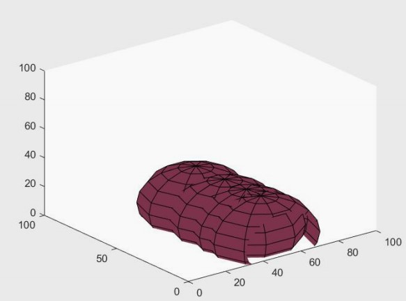
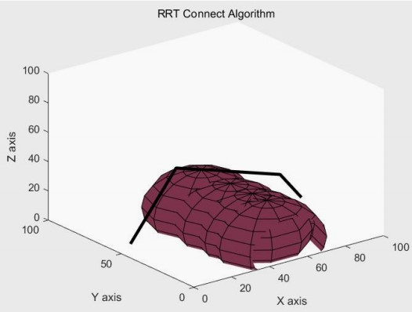
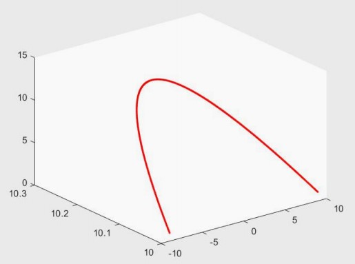
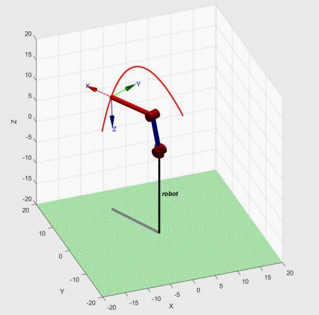
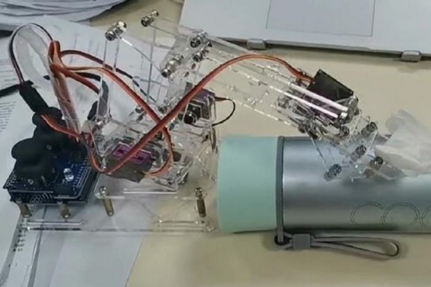

# Automatic Trajectory Planning Algorithm (RRT-connect) for Arduino Robots

<br/>


## About The Project
A four-degree-of-freedom robot arm was deployed to carry objects over obstacles.
* A static environment with obstacles is first established in Matlab
* RRT-connect will automatically plan a feasible path, which is then fitted by the B-spline to generate a smooth path
* The planned path will be sent to the robot through the instructions on the windows side, and the movement of the robot will be controlled by Arduino when it receives control commands 

### Project Structure
```bash
Arduino_Robots
│   RRTconnect3D.m                # 3D Trajectory planning function (RRT-connect 3D)
|   Runme.m                       # Matlab file that defines the obstacles and optimize feasible path 
│   Coordiate2Angle.py            # Convert the a series of three-dimensional coordinate points into an angle sequence for the robot
│   Comm_Sender_Windows.py        # Control commands sender in Windows
│   Comm_Receiver_Arduino.ino     # Running in Arduino. Receive commands and control motors
│
└───Videos
    │   Arduino Robot.mp4         # Video showing Arduino robot movement and grasping
    │   Matlab Simulation.wmv     # robot simulation in Matlab
```

### Environment Modeling


### The Planned Path and The Path Optimized with B-spline


### Simulation in Matlab and Deployment to Arduino
